# ラムネちゃん固有設定

## 海苔対策

- Bodyのインスペクタを開き要素3である"MT_Ramune_FaceParts"のシェーダーを"VRChat/Mobile/Particles/Multiply"へ変更する

<a href="image/Ramune_uniquesettings/Ramune_Nori_counterplan.png" target="_blank">
    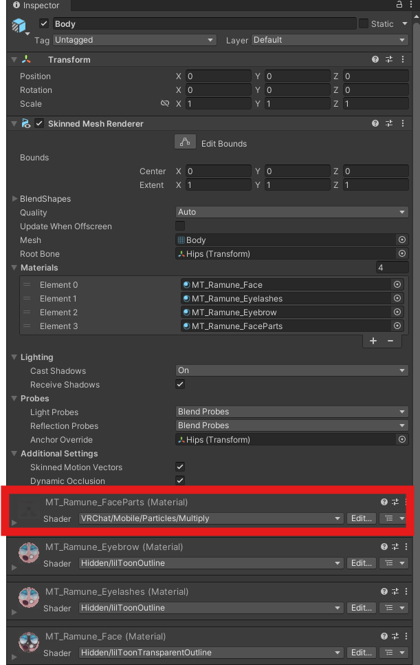
</a>

## 各種シェーダー変更

### 髪の毛パーティクル

- Ramune_Hair/HairParticleの中にあるEmitter_CircleとEmitter_CloverのシェーダーをVRChat/Mobile/Particles/Additiveへ変更する

<a href="image/Ramune_uniquesettings/Ramune_hairparticle_root.png" target="_blank">
    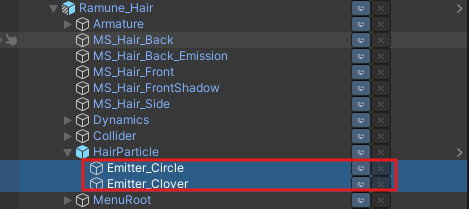
</a>

<a href="image/Ramune_uniquesettings/Ramune_hairparticle_settings.png" target="_blank">
    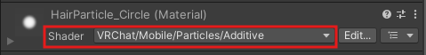
</a>

### 金平糖

- Ramune_Brooch/Items/Konpeito_L/Konpeito/KonpeitoのシェーダーをVRChat/Mobile/Standard Liteへ変更する(Konpeito_Rは同じマテリアルを使っているっぽいので同時に修正されるはず)

<a href="image/Ramune_uniquesettings/Ramune_konpeito_root.png" target="_blank">
    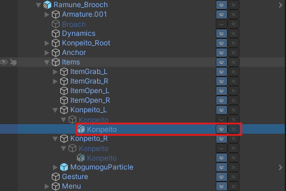
</a>

<a href="image/Ramune_uniquesettings/Ramune_konpeito_settings.png" target="_blank">
    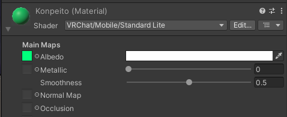
</a>

### 金平糖待機パーティクル

- Ramune_Brooch/Items/ItemGrab_L/KonpeitoWaitParticleのシェーダーをVRChat/Mobile/Particles/Additiveへ変更する(ItemGrab_Rは同じマテリアルを使っているっぽいので同時に修正されるはず)

<a href="image/Ramune_uniquesettings/Ramune_konpeitowait_root.png" target="_blank">
    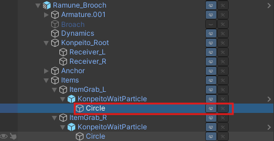
</a>

<a href="image/Ramune_uniquesettings/Ramune_konpeitowait_settings.png" target="_blank">
    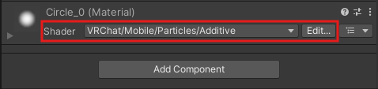
</a>

### もぐもぐパーティクル(金平糖を食べる時のパーティクル) 

- Ramune_Brooch/Items/MogumoguParticleのCircleとStar_2_1とStar_2のシェーダーをVRChat/Mobile/Particles/Additiveへ変更する(下記イメージはCircle_1の変更例)

<a href="image/Ramune_uniquesettings/Ramune_moguparticle_root.png" target="_blank">
    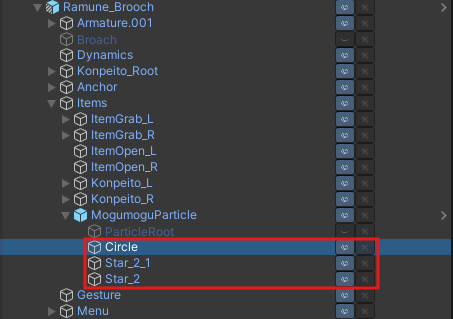
</a>

<a href="image/Ramune_uniquesettings/Ramune_moguparticle_settings.png" target="_blank">
    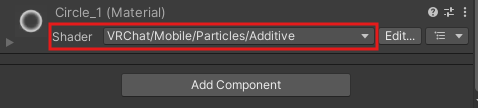
</a>

### メガネ

- GlassesSet/GrabItem_Glasses/GrabItem/Gl_MainCnst/Gl_SubConst/Gl_Root/Glasses/Glassesを開きGlass(Material)のシェーダーをVRChat/Mobile/Particles/Multiplyへ変更する

<a href="image/Ramune_uniquesettings/Ramune_glasses_root.png" target="_blank">
    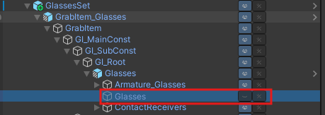
</a>

<a href="image/Ramune_uniquesettings/Ramune_glasses_settings.png" target="_blank">
    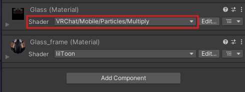
</a>

[← メインページに戻る](../index.md)